# SDSC8007 Iceberg Classifier - Image-only CNN Ensemble + Angle KNN + Model Stacking

> Kaggle Competition: [Statoil/C-CORE Iceberg Classifier Challenge](https://www.kaggle.com/competitions/statoil-iceberg-classifier-challenge/)

**Group Members:**

- 72540080 Qi You
- 72540670 Mengshi Zhang

# 1. Task Description and Evaluation Metric

This project is based on the [Statoil/C-CORE Iceberg Classifier Challenge](https://www.kaggle.com/competitions/statoil-iceberg-classifier-challenge/). The task is to determine whether an observed object is a ship or an iceberg from satellite synthetic aperture radar (SAR) images. In real maritime scenarios, iceberg detection is very important for route safety and risk warning, so the accuracy of this task is directly related to the safety of vessels at sea.

This is a binary image classification problem. Each sample in the training set contains two radar channels, `band_1` and `band_2`, one radar incidence angle feature, `inc_angle`, and a binary label, `is_iceberg`. Specifically:

- `is_iceberg = 0` represents a ship;
- `is_iceberg = 1` represents an iceberg.

The model outputs the probability that a sample belongs to the iceberg class, rather than a hard classification label of 0 or 1.

The official evaluation metric is binary log loss. Given the true label $y_i \in \{0,1\}$ and predicted probability $p_i$, the metric is defined as:

$$
\mathrm{LogLoss}=-\frac{1}{N}\sum_{i=1}^{N}\left[y_i\log(p_i)+(1-y_i)\log(1-p_i)\right]
$$

This metric considers not only whether the classification is correct, but also penalizes overconfident wrong predictions. For example, if the true label is 0 but the model output is very close to 1, the penalty will be very large. This is consistent with the requirements of this task, because overconfident wrong predictions may bring serious risks to maritime navigation and should be avoided as much as possible.

# 2. Data Analysis

The dataset is stored in the `dataset` directory. The basic statistics are as follows:

| Dataset      | Number of Samples | Fields                                                        |
| ------------ | ----------------: | ------------------------------------------------------------- |
| `train.json` |              1604 | `id`, `band_1`, `band_2`, `inc_angle`, `is_iceberg`           |
| `test.json`  |              8424 | `id`, `band_1`, `band_2`, `inc_angle`                         |

Each `band_1` and `band_2` is a one-dimensional array of length 5625. After reshaping it to `75 x 75`, it becomes the radar image.

We then manually constructed a third channel:

$$
\text{band}_3=\frac{\text{band}_1+\text{band}_2}{2}
$$

Therefore, the input tensor shape for the CNN is `(3, 75, 75)`, which is closer to the common three-channel format used in image classification tasks.

The following figure shows example satellite images labeled as ship/iceberg. The first two channels come from the dataset, and the third channel is obtained by averaging the HH and HV channels:

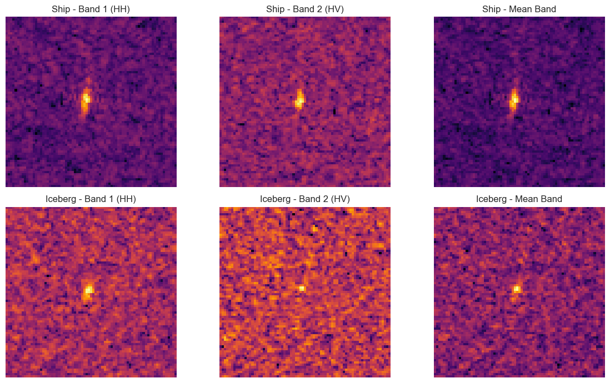

## 2.1 Prior Information Hidden in the Incidence Angle `inc_angle`

In the EDA part of the code, missing values were first filled with the median. Then, the distribution of the incidence angle `inc_angle` was analyzed, as shown below:

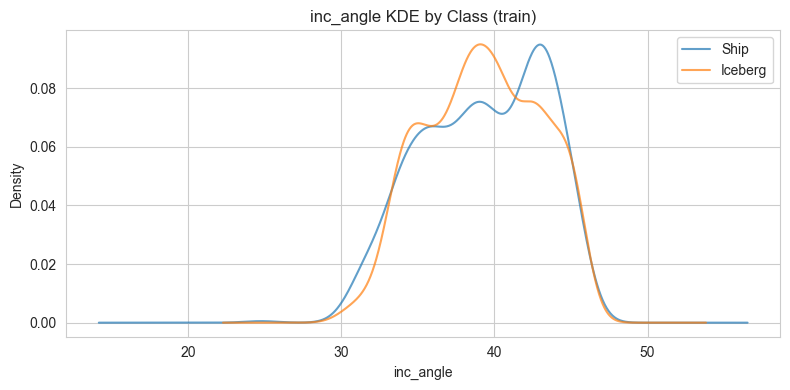

The figure clearly shows that the peaks of `inc_angle` for ships and icebergs are very different.

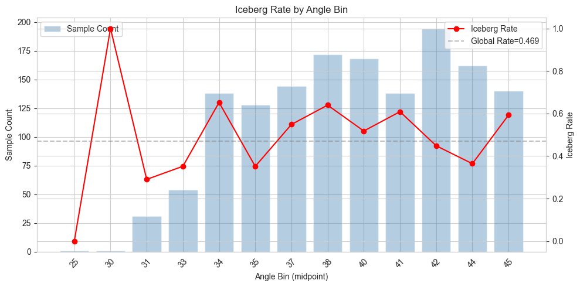

As the angle changes, the probability of a sample being an iceberg fluctuates noticeably. In some angle ranges, the iceberg ratio is significantly higher than the global average, such as around 34 degrees and 37-41 degrees. This suggests that iceberg samples are not uniformly distributed across all incidence angles, but instead cluster around certain incidence angle ranges. Ship samples show a similar phenomenon. Therefore, `inc_angle` contains useful prior information about the label distribution.

Based on this observation, we decided to process `inc_angle` separately from the radar images, so that the prior information contained in `inc_angle` could be fully utilized.

## 2.2 Information in Radar Images

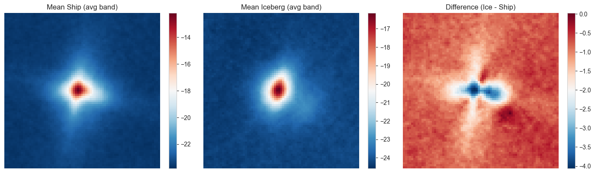

We calculated the mean radar image separately for iceberg and ship samples, and then subtracted the two mean images. The resulting difference map shows that there are very clear differences between the two classes. This indicates that the radar images alone already contain enough information to distinguish ships from icebergs.

In the baseline stage, we first attempted to classify the dataset using only the radar images. After that, we introduced the angle information and observed how much performance improvement it brought.

# 3. Main Challenges of the Task

This task faces several challenges. First, discovering that the radar incidence angle `inc_angle` contains prior information about the label distribution is itself non-trivial, while relying only on radar images often leads to limited performance. Second, the training set is very small, with only 1604 images, so directly using a traditional deep CNN model can easily lead to overfitting. Meanwhile, SAR images contain strong noise, and the shapes and textures of the targets are far less intuitive than those in ordinary RGB images. In addition, log loss is highly sensitive to wrong predictions with high confidence, which means the model must not only achieve high accuracy but also avoid overly confident mistakes, since such mistakes receive very large penalties.

# 4. Baseline Model

The baseline model in this project is an AI-assisted SmallCNN network. We selected this baseline because its structure is simple, it is less likely to overfit, and it is a classic model type for binary image classification tasks.

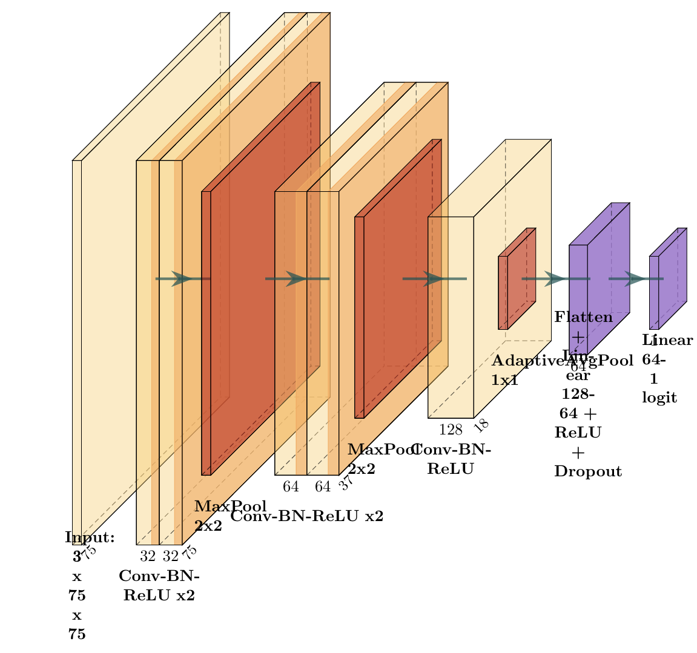

SmallCNN only uses the three-channel image constructed from `band_1`, `band_2`, and the averaged channel `band_3` as input. It does not use `inc_angle`. The purpose is to first verify whether the image itself has sufficient discriminative power. Its main structure is:

- Input: `3 x 75 x 75` image;
- Convolution block 1: `Conv2d(3,32)`, BatchNorm, ReLU, `Conv2d(32,32)`, BatchNorm, ReLU, MaxPool, Dropout2d;
- Convolution block 2: `Conv2d(32,64)`, BatchNorm, ReLU, `Conv2d(64,64)`, BatchNorm, ReLU, MaxPool, Dropout2d;
- Convolution block 3: `Conv2d(64,128)`, BatchNorm, ReLU, AdaptiveAvgPool;
- Classification head: Flatten, Linear(128,64), ReLU, Dropout, Linear(64,1);
- Loss function: `BCEWithLogitsLoss`.

The training settings are as follows:

| Setting                 | Value                  |
| ----------------------- | ---------------------- |
| Random seed             | 1919810                |
| Validation strategy     | 5-fold StratifiedKFold |
| Optimizer               | AdamW                  |
| Learning rate           | 0.00216                |
| Weight decay            | 0.00047                |
| Batch size              | 32                     |
| Max epochs              | 120                    |
| Early stopping patience | 15                     |
| Scheduler               | CosineAnnealingLR      |

The learning rate and weight decay were obtained by Optuna search using 3-fold cross-validation inside the training set. `CosineAnnealingLR` was used to implement dynamic learning rate decay.

The final OOF prediction result of SmallCNN is:

| Model                 |  LogLoss |      AUC |      Acc |
| --------------------- | -------: | -------: | -------: |
| SmallCNN (image-only) | 0.230654 | 0.968477 | 0.902743 |

This result shows that SAR images themselves already contain strong classification information.

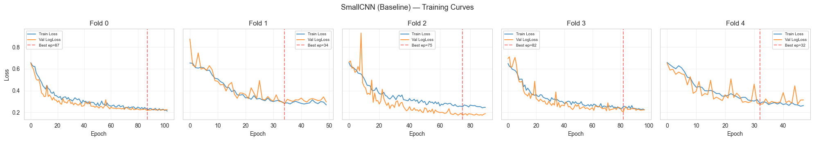

# 5. Validation Strategy

This project mainly uses local 5-fold StratifiedKFold cross-validation. This validation strategy is suitable for the very small sample size of this competition, because it makes fuller use of the limited training data.

For CNN models, we used `StratifiedKFold(n_splits=5, shuffle=True, random_state=1919810)`. The CNN model was trained separately on the five folds, and the best model of each fold was saved. Finally, the overall log loss, AUC, and accuracy were calculated using the out-of-fold predictions.

Angle KNN also generated OOF predictions by fold. The angle prediction for each validation fold was produced only by the KNN fitted on the corresponding training folds. The LightGBM and Logistic meta models were also validated using 5-fold cross-validation.

To prevent data leakage, we only split, trained, and validated on `train.json`. We strictly avoided using `test.json` during local validation, so that the model would not learn any distributional information from the test set.

# 6. Model Improvements

## 6.1 Data Augmentation

When implementing the dataset class, we introduced data augmentation for the training set. This included random horizontal or vertical flipping with a probability of 50%, and random rotation by one of 0, 90, 180, or 270 degrees.

During 5-fold CV validation, we also introduced Test-Time Augmentation. For the test set, predictions were made on the original image, the horizontally flipped image, and the vertically flipped image. The three predictions were then averaged. This helps reduce the randomness of a single prediction.

## 6.2 Multi-CNN Model Stacking

At the beginning of the task, we tried using a single original ResNet model for fitting, but the result was not satisfactory. After discussion, we believed that this was probably because the dataset was very small, containing only slightly more than one thousand images. Using a single large model can easily lead to overfitting. ResNet is designed for million-scale datasets and has a large number of parameters, so its flexibility is too high for this task. Therefore, we decided to introduce multiple small CNN networks for stacking. This has several advantages.

Small CNNs are more friendly to small datasets and are less likely to overfit. Models with three different structures may produce different error patterns, and stacking is more favorable for log loss. Averaging predictions can effectively weaken the probability of extremely confident wrong predictions, because log loss penalizes such mistakes heavily. At the final stacking stage, we also fed the mean and variance of multiple model predictions into Logistic Regression or LightGBM. The variance reflects the disagreement among models and therefore becomes part of the feature set.

We introduced two classic CNN variants. MiniVGG gradually extracts image features by stacking small convolution kernels and pooling layers, while Small ResNet adds residual connections to a relatively shallow network to alleviate training degradation and enhance feature representation.

After averaging the OOF prediction probabilities of the three models, the result was:

| Model             |  LogLoss |      AUC |
| ----------------- | -------: | -------: |
| CNN Ensemble Mean | 0.206042 | 0.976536 |

Compared with the SmallCNN baseline, simply averaging the results of three models reduced log loss from 0.230654 to 0.206042. This indicates that different CNN models do have a certain degree of complementarity.

## 6.3 Introducing Incidence Angle `inc_angle` Information

According to the previous EDA results, the incidence angle `inc_angle` has a clear correlation with the final class label. We used KNN (`n_neighbours=25`) to model the single numerical feature `inc_angle`, predicting whether an image is an iceberg based only on `inc_angle`. The OOF prediction result is as follows:

| Stage     |  LogLoss |      AUC |
| --------- | -------: | -------: |
| Angle KNN | 0.229794 | 0.972897 |

It can be seen that using only the angle information already achieves a result close to the baseline. This shows that the angle feature itself is very strong.

## 6.4 Logistic/LightGBM Meta Model

Finally, we collected the output metadata from the CNN models and the Angle KNN model as input features for the final Logistic/LightGBM model. The features include:

- Mean prediction of the three CNNs: `cnn_mean`
- Standard deviation of the three CNN predictions: `cnn_std`
- Minimum and maximum values of the three CNN predictions: `cnn_min`, `cnn_max`
- OOF prediction of Angle KNN: `angle_knn_pred`
- Original value of the incidence angle: `inc_angle`
- Whether the incidence angle is missing: `angle_missing`

We trained Logistic Regression and LightGBM separately, and the results are as follows:

| Stage                 |  LogLoss |      AUC |
| --------------------- | -------: | -------: |
| Logistic Meta         | 0.114475 | 0.991907 |
| LightGBM Meta (Final) | 0.113563 | 0.992190 |

Stacking brought the most significant improvement. Compared with the SmallCNN baseline, the LightGBM Meta Model reduced log loss from 0.230654 to 0.113563. Compared with the CNN Ensemble Mean solution, the log loss was also reduced from 0.206042 to 0.113563. This shows that the outputs of the image models and the angle model are strongly complementary, and the final meta layer effectively fuses information from both sides.

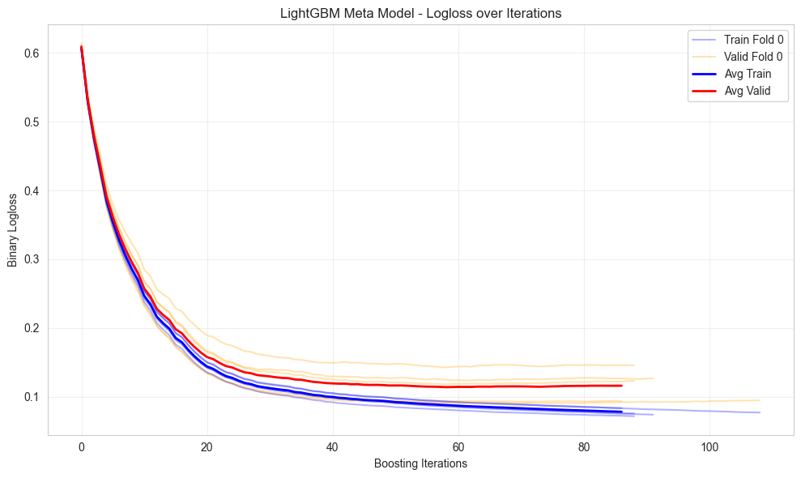

## 6.5 Optuna Hyperparameter Tuning

We used the Optuna library to tune model hyperparameters and further improve performance.

First, we tuned the baseline CNN model, adjusting only `lr` and `wd` because CNN training is relatively slow. Then, we tuned the final LightGBM meta model. The final LightGBM configuration selected a relatively shallow and strongly regularized model, with `max_depth=2`, `num_leaves=4`, and `min_child_samples=30`. This is consistent with the characteristics of this project, namely a small sample size and a high risk of overfitting.

# 7. Final Results

In the end, the solution combining three CNN models, Angle KNN, and LightGBM Meta Stacking achieved the best result.

| Model                 | LogLoss  | AUC      |
| --------------------- | -------- | -------- |
| SmallCNN (Baseline)   | 0.230654 | 0.968477 |
| CNN Ensemble Mean     | 0.206042 | 0.976536 |
| Angle KNN             | 0.229794 | 0.972897 |
| Logistic Meta         | 0.114475 | 0.991907 |
| LightGBM Meta (Final) | 0.113563 | 0.992190 |

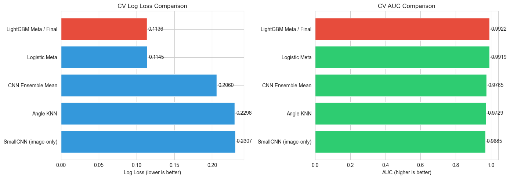

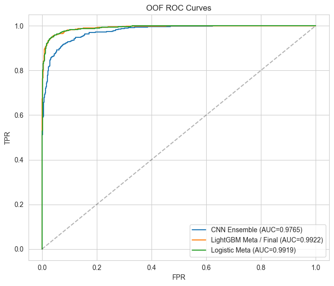

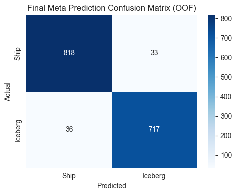

The following figure shows the feature weights assigned by the LightGBM model to different features, indicating the influence of each input metadata feature on the final result:

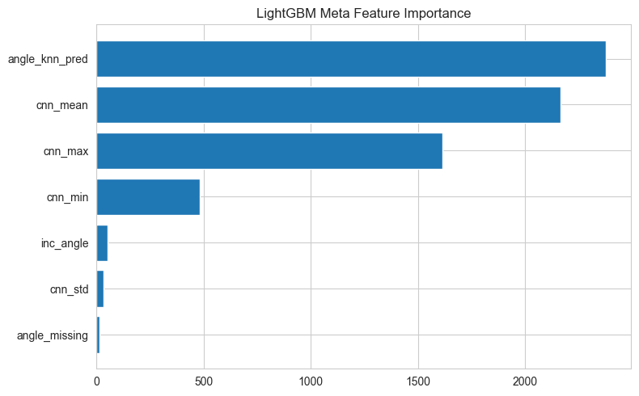

## 7.1 Kaggle Evaluation Result

We uploaded the final prediction CSV file to Kaggle for evaluation. On the private test set, we achieved a score of 0.10186 and ranked in the top 10 on the Private Leaderboard. This effectively demonstrates the robustness and accuracy of our model on unseen test data.

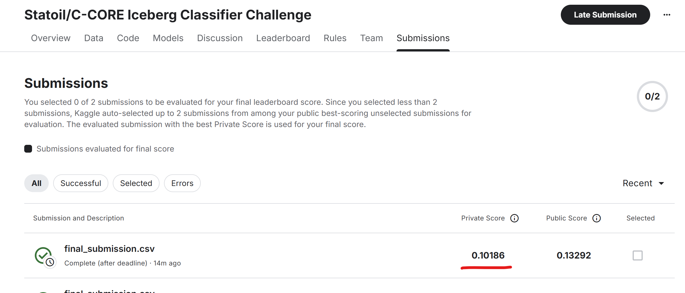

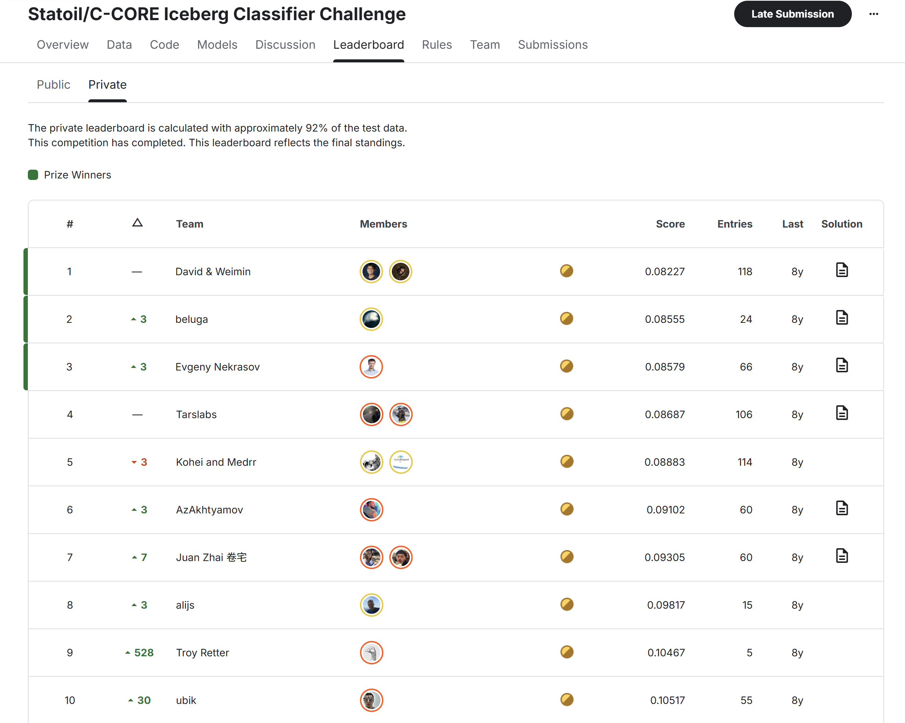

# 8. AI Tool Usage Statement

We mainly used AI to help design the structures of the three Small CNN networks. Since we did not have much experience in neural network architecture design, we eventually relied on AI assistance for this part of the work.

The pipeline design, model improvement, and tuning were all completed jointly after discussion. We only occasionally consulted AI for experience related to architecture design.

# 9. Discussion and Reflection

In this project, the most effective improvements mainly came from three aspects.

First, EDA showed that `inc_angle` is not an ordinary auxiliary variable, but contains clear class prior information. Therefore, we modeled the image branch and angle branch separately, and fused them using the meta model at the end. This was very important for improving the final performance. At the beginning of the task, we did fall into the trap of directly merging `inc_angle` into ResNet and fitting everything together, but the result was not good. After realizing that the angle feature contained important prior information, the solution became much clearer.

Second, with only 1604 training images, lightweight CNNs are more suitable for this task than the original ResNet. We tried using a single complete ResNet model for prediction, but the performance was poor and overfitting was observed. After improvement, the ensemble of SmallCNN, MiniVGG, and SmallResNet reduced the random errors of a single model and also lowered the risk of overconfident wrong predictions in log loss.

Finally, the LightGBM Meta model effectively aggregated information such as the CNN prediction mean, prediction variance, Angle KNN output, and the angle missing indicator, achieving the best result. We also tried a Logistic Regression model, but its performance was slightly weaker than LightGBM, suggesting that the final fusion relationship was not completely linear.

Of course, our solution still has limitations. On one hand, the hyperparameter tuning search was not very large-scale, so there may still be room for improvement. On the other hand, the strong prior information contained in `inc_angle` can actually be regarded as a loophole in the task itself. Under normal circumstances, the classification result should not depend on the radar incidence angle, but only on the image content. If the goal is to achieve a better result using only image information, there is still substantial room for improvement in model design. For example, we could refer to ideas from XGBoost and perform large-scale stacking and residual learning with many CNN models.

# 10. Reproducibility

The results are reproducible. The random seed used throughout the project is 1919810, with sequential adjustments during 5-fold CV. The code is open-sourced in the GitHub repository:

https://github.com/juzhenzhishang/sdsc8007.git
